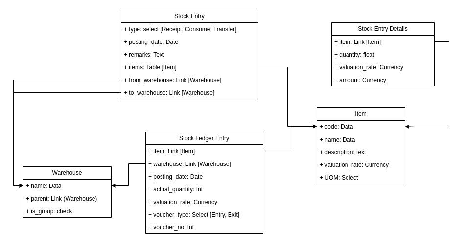

# X Warehouse Management System

A WMS for a fictional electronics company, modeled similarly to EXPNext\'s stock module, but simplified and customized.

## Database Design



## Installation

You can install this app using the [bench](https://github.com/frappe/bench) CLI:

```bash
cd $PATH_TO_YOUR_BENCH
bench get-app $URL_OF_THIS_REPO --branch develop
bench install-app xwms
```

## Running Tests

To run the tests, you can use the following command:

```bash
cd xwms
bech use xwms.local
```

Doctype tests:

```bash
bench run-tests --doctype "Stock Entry"  
```

Report tests:

```bash
bench run-tests --module xwms.x_warehouse_management_system.report.stock_ledger_report.test_stock_ledger_report

bench run-tests --module xwms.x_warehouse_management_system.report.stock_ledger_report.test_stock_balance_report.test_stock_balance_report
```

### Contributing

This app uses `pre-commit` for code formatting and linting. Please [install pre-commit](https://pre-commit.com/#installation) and enable it for this repository:

```bash
cd apps/xwms
pre-commit install
```

Pre-commit is configured to use the following tools for checking and formatting your code:

- ruff
- eslint
- prettier
- pyupgrade

### License

mit
